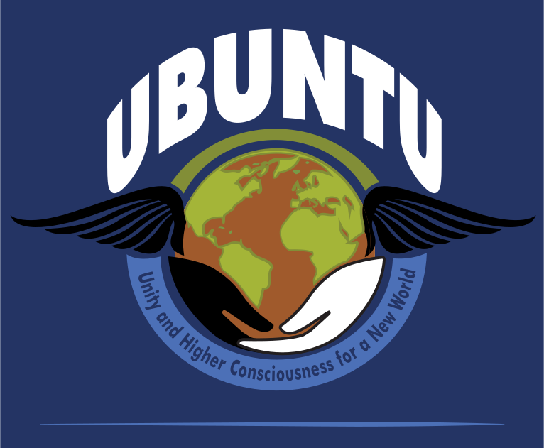

# UBUCON
## Alternative social platform for the UBUNTU movement.

# Motivation
Today we have got Facebook, Twitter, Google Plus, WhatsApp and Telegram as platform to chat and to connect to each other.
All these platforms are collecting data from us and feed us with advertisements, propanda and they are doing censorchip.
We want a free platform to connect to each other, without beeing disturbed and controled by big brother.  
We want to write private messages without anybody is able to read it.  
We want to see the feeds from all of our friends and not what an algorythm might want to show us.

# Solution
Create a decentral platform p2p (peer two peer).  
No registration needed, so non friends don't see you at all.

We found that Scuttlebutt will fit our need, but we have to be sure that its really save to reuse their infrastructur. Maybe we can tunnel our feed additionally via a our own crypto function. So that when Scuttlebutt will be hacked, we are still save and are able to sleep well.  
Also we want to implement some additional features so we need a solution to integrate plugins.
Plugins will make it possible to integrate small tiny apps inside the social platform.

We will also use #hashtags to find what we want much easier. So we could use it also for dating and finding likeminded people.
Sample: You have got the following tags in your bio: **#lookingForDrummer**, **#guitarPlayer**

So someone else can find you after searching the net for people with the hashtag **#guitarPlayer**
Also drummers can find you searching for **#lookingForDrummer**.